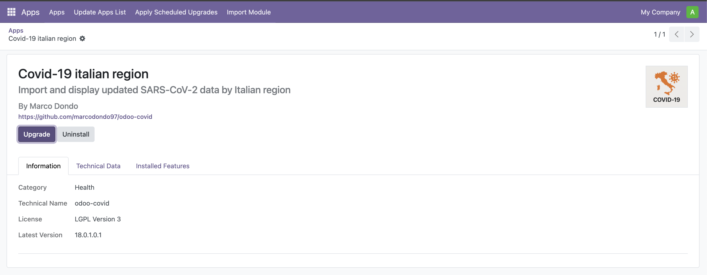
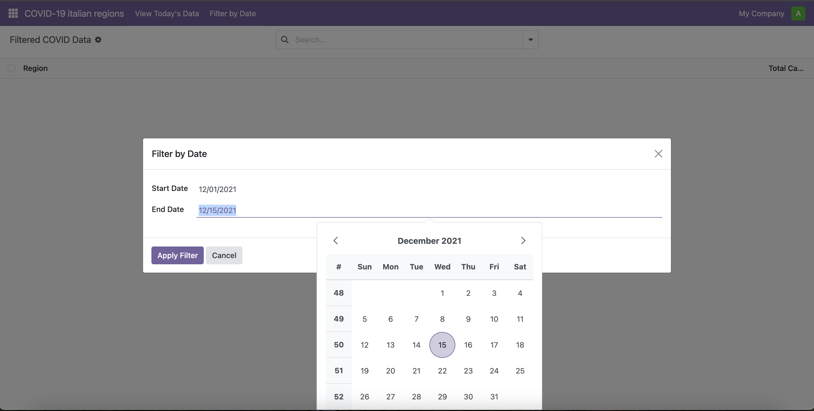
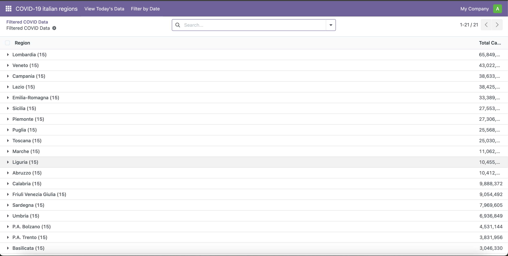
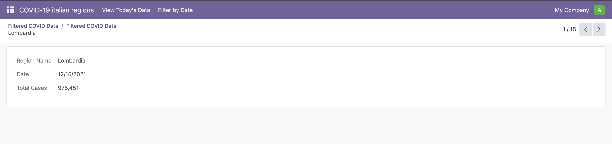
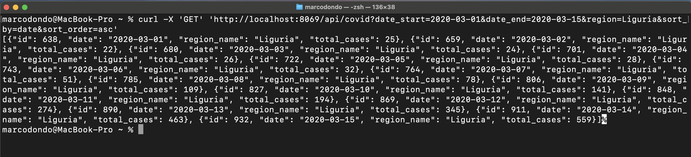

# Covid19 Italian Region Odoo Module

## Introduction

This Odoo module is designed to import and display up-to-date data on the spread of SARS-CoV-2 in Italian regions. The module connects to the [official GitHub repository of the Italian Civil Protection](https://github.com/pcm-dpc/COVID-19) to obtain real-time data and provides an intuitive interface to visualize and analyze this data within the Odoo system.

## Description

The **Odoo COVID-19 Italian Region** module was developed to meet the following objectives:

1. **Goal #1**: Import and display COVID-19 data from Italian provinces
   - Read data from the per-province JSON file on the Italian Civil Protection GitHub repository
   - Store data in the Odoo database
   - Display the grand total of cases aggregated by Italian region
   - Sort results from highest to lowest number of cases (with alphabetical secondary sorting)
   - Show data for the current day when accessing the list view

2. **Goal #2**: Add date filtering capabilities
   - Allow searching for data from any date since February 24th, 2020
   - Implement lazy loading to fetch data from the COVID repository as needed

3. **Goal #3**: Expose data through a REST API
   - Enable filtering by date range and region
   - Allow specification of sorting field and order

The module offers the following features:

- **Data Import**: Automatically retrieves COVID-19 data from the official Italian Civil Protection repository
- **Date Filter**: Allows filtering data by specific date ranges
- **Region View**: Shows aggregated data by Italian region
- **Custom Sorting**: Sorting data by total cases
- **REST API**: Provides an API endpoint to access COVID-19 data from external applications

### Requirements

- Odoo 18
- Python module `requests`

### Installation

#### Standard Installation
1. Clone this repository into the Odoo addons folder
2. Update the applications list in Odoo
3. Search for and install the "Covid-19 italian region" module

#### Docker Demo
For a quick demo without installing Odoo on your system:

1. Clone this repository
2. Make sure you have Docker and Docker Compose installed
3. Run `docker-compose up` in the repository root
4. Access Odoo at http://localhost:8069
5. Create a new database and install the "Covid-19 italian region" module

The Docker setup automatically mounts the local addons directory, allowing you to see your changes immediately.

### API Usage

The module exposes an API endpoint at `/api/covid` that accepts the following parameters:

- `date_start`: Start date (format YYYY-MM-DD)
- `date_end`: End date (format YYYY-MM-DD)
- `region`: Optional region filter
- `sort_by`: Field for sorting ('date', 'region_name', 'total_cases')
- `sort_order`: Sort order ('asc' or 'desc')

#### API Documentation

Complete API documentation is available in the [Swagger specification](https://petstore.swagger.io/?url=https://raw.githubusercontent.com/marcodondo97/odoo-covid/main/docs/swagger.yaml).

#### Example cURL Request

```bash
curl -X 'GET' 'http://localhost:8069/api/covid?date_start=2020-03-01&date_end=2020-03-15&region=Liguria&sort_by=date&sort_order=asc'
```

This request will return COVID-19 data for the Liguria region between March 1st and March 15th, 2020, sorted by total cases in sorted by date in ascending order.

### Result


<br>

<br>

<br>

<br>


